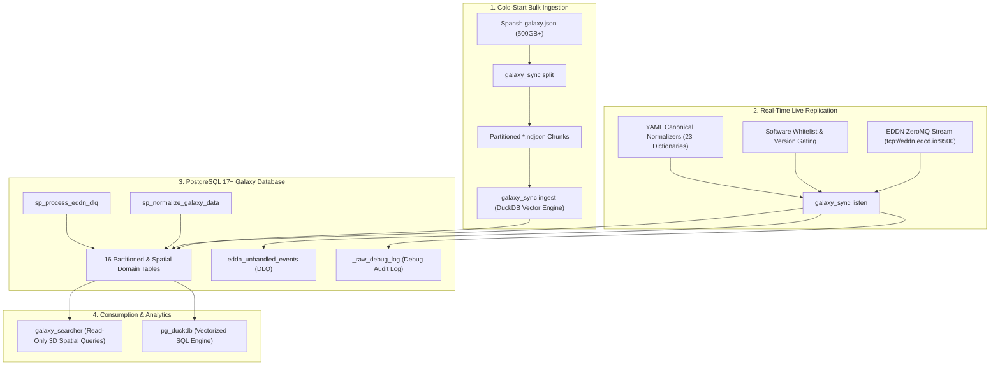

# Elite Dangerous Galaxy Sync for PostgreSQL (`ed-galaxy-sync-pg`)

[](https://www.python.org/downloads/)
[](https://docs.astral.sh/uv/)
[](https://www.postgresql.org/)
[](https://github.com/duckdb/pg_duckdb)
[](license.md)

A high-performance replication, ingestion, and analytics engine for bootstrapping and live-synchronizing a complete, indexed **PostgreSQL** galaxy database for Elite Dangerous.

It seamlessly combines ultra-fast bulk loading of monolithic 500GB+ [Spansh](https://spansh.co.uk) dumps (via an embedded DuckDB vectorized engine) with real-time [EDDN](https://eddn.edcd.io) ZeroMQ live stream replication, canonical token normalization, 3D Euclidean spatial indexing (`cube`), and strict Role-Based Access Control (RBAC).

> [!CAUTION]
> ### A Note on AI, Software Craft, and Why This Code Exists
>
> I want to be upfront and blunt about how AI was used on this project, where I draw a hard line in the sand, and more importantly, how I feel about it on a more broad level.
>
> Look... I have massive, fundamental gripes with artificial intelligence. The environmental toll of running massive data center furnaces is pretty disgusting, and the blatant theft of scraping people's work without permission is impossible to defend. A couple of years ago, corporate executives used the hype around AI as a convenient excuse to lay me off. Since then, while I've watched former coworkers get dragged through the mud of mindless "you MUST use AI for everything" corporate mandates, I've managed to stay employed the old-fashioned way, by actually knowing how to solve hard problems, understand systems, and write real code.
>
> Watching people posture as "artists" or "creators" while generating synthetic images, fake voice acting, or slop stories and lore makes my blood curdle. It's not creativity, it's literal theft, laundering the actual talent, sweat, and soul of real human beings into digitized mush.
>
> But programming has always lived in a messy, chaotic in between or trench or some shit. I have never considered raw lines of syntax as some high art form. The real craft is the ideas, the problems, and how you solve them, the architecture that is designed, with a wholistic view. It's figuring out where data lives, how state transitions, how things crash when everything hits the fan, and how to model messy real-world garbage. In that context, using an LLM to bounce ideas off of, write boring documentation, check syntax, or scaffold boilerplate isn't much different than copy-pasting from Stack Overflow or leaning on IntelliSense and autocomplete, tools that Visual Studio and other IDEs have given us for decades. It speeds up the typing, but it doesn't do the godddamned thinking!
>
> Before publishing this repo, I'll be squashing the git history into a single clean release. But the private log tells the real story, over 170 commits and 50,000+ lines of *absolute* code churn hammered out in ... idk, 15 days? This wasn't some prompt-kiddie turnkey project. It started out as a tiny hobby script because I was frustrated that I couldn't search planetary rings by density for Elite Dangerous via the many amazing community tools built by others* and spiraled through multiple separate architectural overhauls.
>
> <small>*\*(Big shout out to [Spansh](https://spansh.co.uk) and [Inara](https://inara.cz) for their great platforms, and for the decade of community work behind them from all the contributors to [EDCD](https://github.com/EDCD), [EDDN](https://eddn.edcd.io), and [EDMC](https://github.com/EDCD/EDMarketConnector) among others... all which pale in comparison to my little project here.)*</small>
>
> As an example, I went through several major efforts, all of which where I threw away mountains of work:
>
> 1. **The DuckDB Start:** A simple offline script trying to crunch through Spansh's multi-gigabyte JSON dumps into a local DuckDB file.
> 2. **The PostgreSQL Migration:** When DuckDB choked on what I actually wanted, I threw a fit and played some other video games. And then, I threw it in the trash and rebuilt everything on Postgres, setting up relational staging tables, JSONB schemas, and spatial `cube` indexes.
> 3. **The EDDN Live Stream Pivot:** Static dumps got boring, I wanted live data. This was my personal project, so I tore it up again to listen directly to the live EDDN firehose over ZeroMQ, writing custom transformers and dead-letter queues.
> 4. **The Regret:** When I realized my database design was garbage, and making EDDN ingestion a pain in the ass. I destroyed it all and started over. This is when iI... had to reload everything like 4 more times as I iterated. All 500ish gigs. Fsck.
> 5. **Automated SQL Cleanup Procedures:** Inevitably I had misses in my mapping for EDDN tokens from the frontier internal names. When Python started wheezing under cleanup and normalization efforts, I moved the heavy lifting into Postgres stored procedures, writing Python scripts to automatically generate the SQL routines the old-fashioned way from YAML dictionaries.
>
> Those are just the high (low?) lights. An AI cannot design that journey. An AI can read code, but it doesn't have the lived experience of being a software developer or senior data engineer for decades. It doesn't know the sheer misery of a database lock timeout at 2 in the morning. It doesn't know when a design has hit a brick wall, and it sure as hell won't decide to tear down working code and throw away days of effort just to build something better. Hell, it will more often do everything it can to preserve completely dead code paths as "fallback" logic rather than nuke everything and start over. Those choices only come from stubborn human curiosity, frustration, and bruised egos from riding the high of feeling like it works, only to realize your design sucks and you have to redo it all over again.
>
> We're also living in a bubble right now, not dissimilar, but in my opinion, far worse than the dot com bubble of my youth. Venture capital is burning billions (trillions?) to subsidize cheap API tokens, making LLMs look practically free. That party *IS* going to end. When the real bills come due, prices will spike, the subsidies will evaporate, and anyone who relied on AI to build crap they don't actually understand is going to be dead in the water. People, normal people, will lose everything because of the greed and insanity of people who are wealthy, or who think claude already thinks and feels. The only real safety net in software, nay, in life even, is knowing how to build, read, create, modify, throw away, and goddamnit just DO things yourself.
>
> I used AI here as a rubber duck, a technical documentation assistant, and an accelerator for repetitive grunt work. But **I take 100% personal responsibility for every single line of code in this repository.** Every schema, spatial query, stored procedure, migration script, and edge-case handler was manually inspected, reasoned through, rewritten, and held to my own standards*.
>
> <small>*\*(It should be noted that I HATE writing unit tests and documentation, so those standards might be a bit lower... :D)*</small>
> 
> **If something breaks in this toolset, that's on me, not the machine.**
>
> ---
>
> **A Final Thought on the Bigger Picture:**
> Beyond the code, lets all be clear-eyed about what's happening. The wealthy elite and tech oligarchs aren't pushing AI to make our lives better, they're using it to cut payroll, consolidate power, further enrich themeselves, and keep the working class under their thumb. They will continue to tighten the screws on our necks at every opportunity. At the same time, it risks becoming a sort of digital, mental methadone, numbing our curiosity, dulling our critical thinking, and training both programmers and non-programmers alike to passively accept whatever synthetic mush a machine feeds them. Use it as a tool, but keep it firmly in that category. The circular saw doesn't build the house any more than the hammer. Don't let it rot your brain. For fucks sake! Don't let AI or LLM's replace your brain. Keep building real things with your own hands, feet, or whatever appendages you may have available to you (shout out to my differently abled homies).



---

## Key Features & Capabilities

* **Dual-Tier Ingestion Architecture**:
    * **Cold Ingest**: Vectorized chunk parser splitting and streaming 500GB+ JSON dumps into PostgreSQL at millions of records per minute.
    * **Live Ingest**: Non-blocking ZeroMQ consumer processing live journal, commodity, shipyard, outfitting, DSS scan, and Fleet Carrier material feeds.
* **Unified Canonical Normalization Engine**:
    * 23 modular YAML dictionaries mapped to 100% parity with [`EDCD/FDevIDs`](https://github.com/EDCD/FDevIDs).
    * Normalizes Frontier internal tokens (e.g. `$economy_Agri;` $\to$ `Agriculture`, `panthermkii` $\to$ `Panther Clipper Mk II`, `empire_courier` $\to$ `Imperial Courier`).
    * Automatic Title-Case fallback parsing for unmapped `$variable_name;` tokens.
* **3D Spatial Euclidean Indexing**:
    * PostgreSQL `cube` extension + GiST indexes enabling microsecond 3D radial sphere searches and nearest-neighbor lookups relative to Sol `(0, 0, 0)`.
* **Debug Audit Session Logging**:
    * Real-time ZeroMQ probe sniffing (`probe-cmdr`) and dedicated audit logging (`_raw_debug_log`) matching any dot-notation JSON path filter rules for active play session debugging and pipeline testing.
* **Resilient Dead-Letter Queue (DLQ) & Remediation**:
    * Captures unhandled or unwhitelisted events into `eddn_unhandled_events`.
    * Stored procedures [`sp_process_eddn_dlq`](db_setup/05_procedures/sp_process_eddn_dlq.sql) and [`sp_normalize_galaxy_data`](db_setup/05_procedures/sp_normalize_galaxy_data.sql) for automated replay, backfilling, and database-wide normalization.
* **Role-Based Access Control (RBAC)**:
    * Security isolation between read-only analytical consumers (`galaxy_searcher`) and DML-only ingest daemons (`galaxy_updater`).

---

## Table of Contents

1. [Requirements & Installation](#requirements--installation)
2. [Documentation & CLI Usage Guides](#documentation--cli-usage-guides)
3. [Security & User Roles](#security--user-roles)
4. [Telemetry & Checkpointing](#telemetry--checkpointing)
5. [Testing & Quality Assurance](#testing--quality-assurance)
6. [License, Credits & Disclaimers](#license-credits--disclaimers)

---

## Requirements & Installation

Requires **Python 3.14+**, **PostgreSQL 16/17+**, and [**Astral `uv`**](https://docs.astral.sh/uv/).

### Setup Options

#### Option A: Local Development / Workspace Setup (Recommended)

Sync dependencies and register local console entrypoints (`galaxy_sync`, `db_setup`) into `.venv`:

```bash
# 1. Clone repository
git clone https://github.com/dreamwraith/ed-galaxy-sync-pg.git
cd ed-galaxy-sync-pg

# 2. Synchronize environment with uv
uv sync
```

*Allows invoking `galaxy_sync` and `db_setup` from any shell directory without prefixing `uv run`.*

#### Option B: Global CLI Tool Installation

Install directly into your user system PATH as a standalone command line utility:

```bash
uv tool install . --force
```

*Allows invoking `galaxy_sync` and `db_setup` from any shell directory without prefixing `uv run`.*

#### Option C: Production Distribution Wheel

Build and install a standalone wheel package:

```bash
uv build
uv tool install dist/ed_galaxy_sync_pg-*.whl --force
```

### Initial Database Deployment

Deploy the complete PostgreSQL schema (extensions, tables, spatial indexes, roles, stored procedures):

> [!WARNING]
> **Credential Security**: Inline CLI connection flags (`--host`, `--user`, `--password`) and local `.env` files are provided strictly for convenience during local development, testing, and initial setup. **Never use plaintext `.env` files or inline CLI passwords in production environments.**
>
> For production deployments, inject PostgreSQL environment variables dynamically at runtime (e.g., via Kubernetes/Docker secrets or systemd credentials), use PostgreSQL's native `~/.pgpass` (`%APPDATA%\postgresql\pgpass.conf`) password file, or authenticate via SSL client certificates.

```powershell
# Set environment variables in current session (PowerShell)
$env:PGHOST = "localhost"
$env:PGUSER = "postgres"
$env:PGPASSWORD = "YOUR_POSTGRES_PASSWORD"

# Deploy schema without exposing inline passwords
uv run db_setup --action all
```

---

## Documentation & CLI Usage Guides

All operational workflows, command options, step-by-step procedures, and diagnostic tools are documented in the **[Dedicated CLI & Usage Guide (`usage.md`)](usage.md)**.

### Quick Reference & Command Index

| Operational Task | Command / Tool | Documentation Link |
|---|---|---|
| **Live Stream Replication** | `galaxy_sync listen` | [Real-Time EDDN Stream Replication](usage.md#1-listen--real-time-eddn-stream-replication) |
| **Bulk Vectorized Ingestion** | `galaxy_sync ingest` | [DuckDB High-Speed Bulk Ingestion](usage.md#2-ingest--duckdb-high-speed-bulk-ingestion) |
| **Monolithic Dump Splitting** | `galaxy_sync split` | [Massive JSON Dump Splitter](usage.md#3-split--massive-json-dump-splitter) |
| **Live Stream Debug Sniffer** | `galaxy_sync probe-cmdr` | [probe-cmdr & Debug Audit Logging](usage.md#4-probe-cmdr-alias-probe--debug-audit-logging) |
| **Schema & Procedure Manager** | `db_setup` | [Modular Database Orchestrator](usage.md#5-db_setup--modular-database-orchestrator) |
| **3D Radial & Spatial Queries** | `misc/query_examples.py` | [3D Spatial & Search Verification CLI](usage.md#6-miscquery_examplespy--3d-spatial--search-verification-cli) |
| **Data Normalization & Procedures** | Stored Procedures | [Data Normalization & Stored Procedures](usage.md#data-normalization--stored-procedures) |
| **Quality Assurance** | `pytest` & `ruff` | [Testing & Quality Assurance](usage.md#testing--quality-assurance) |

### Additional Documentation Guides

* **[Dedicated CLI & Usage Guide (`usage.md`)](usage.md)** — Full CLI flag reference, global connection parameters, 5-step initial load workflow, commander probe sniffing sequence, and diagnostic SQL examples.
* **[Database Architecture & Runbook (`db_setup/readme.md`)](db_setup/readme.md)** — In-depth database layout, 16 domain table definitions, cube GiST spatial indexing, stored procedures, and migration actions.

---

## Security & User Roles

| Role | Permissions | Security Boundary |
|---|---|---|
| `galaxy_searcher` | `SELECT` on all tables/views, `EXECUTE` on pure functions (`system_distance_3d`) | **Read-Only**: Cannot insert, update, delete, or execute modifying procedures / DDL. |
| `galaxy_updater` | `SELECT, INSERT, UPDATE, DELETE` on all tables, `USAGE/SELECT` on sequences, `EXECUTE` on modifying procedures (`sp_normalize_galaxy_data`, `sp_process_eddn_dlq`) | **DML Only**: Zero DDL permissions (`CREATE` revoked on `public`). |
| `duckdb_users` | `SELECT` on all tables/views in `public`, `NOLOGIN`, inherited by `galaxy_searcher` and `galaxy_updater` | **pg_duckdb Query Role**: Execution role required when `duckdb.force_execution = true`. |

---

## Telemetry & Checkpointing

| Artifact / Table | Location | Purpose |
|---|---|---|
| `_ingested_tables` | PostgreSQL | Tracks `(filename, table_name)` checkpoints for granular bulk ingest crash resumption. |
| `eddn_unhandled_events` | PostgreSQL | Dead-Letter Queue (DLQ) capturing unhandled or unwhitelisted EDDN messages. |
| `_raw_debug_log` | PostgreSQL | Debug audit log capturing full raw JSON payloads matching configured filter rules. |
| `.run_logs/galaxy_sync_YYYYMMDD_HHMMSS.log` | Local File | Timestamped rotating execution log. |
| `.run_logs/listen_status.json` | Local File | Real-time JSON telemetry status file tracking throughput and unmapped token metrics. |

---

## Testing & Quality Assurance

The codebase includes an extensive suite of unit and integration tests covering DuckDB parsing, EDDN ZeroMQ transformers, DLQ routing, normalization dictionaries, RBAC security, and SQL generation.

```powershell
# 1. Run all unit and transformer test cases
uv run pytest tests/ -v

# 2. Run Ruff linter and code style enforcement
uv run ruff check .
```

---

## License, Credits & Disclaimers

* **License**: GNU Lesser General Public License v3.0 (LGPL-3.0). See [license.md](license.md) for details.
* **Elite Dangerous**: Developed and published by [Frontier Developments plc](https://www.frontier.co.uk/).
* **EDDN & FDevIDs**: Maintained by the [Elite Dangerous Community Developers (EDCD)](https://github.com/EDCD).
* **Spansh Galaxy Dumps**: Provided by [Spansh.co.uk](https://spansh.co.uk).
* **AI-Assisted Development**: Portions of this project—including technical documentation, code self-review and refactoring analysis, and unit/integration test suite construction—were developed with the assistance of AI tools, with all logic, schemas, and implementations curated, reviewed, and validated.
