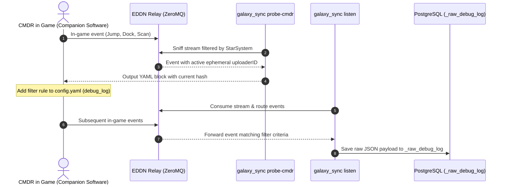

# Elite Dangerous Galaxy Sync — CLI & Usage Guide

Comprehensive operational manual, CLI reference, and diagnostic runbook for `galaxy_sync`, `apply_schema`, and supporting verification tools.

For architectural overview, system capabilities, database schemas, and license information, see [README.md](readme.md) and [Database Architecture & Runbook](db_setup/readme.md).

---

## Table of Contents

1. [CLI Entry Points & Quick Reference](#cli-entry-points--quick-reference)
2. [Global CLI Flags](#global-cli-flags)
3. [Primary CLI Workflows](#primary-cli-workflows)
   * [1. `listen` — Real-Time EDDN Stream Replication](#1-listen--real-time-eddn-stream-replication)
   * [2. `ingest` — DuckDB High-Speed Bulk Ingestion](#2-ingest--duckdb-high-speed-bulk-ingestion)
   * [3. `split` — Massive JSON Dump Splitter](#3-split--massive-json-dump-splitter)
4. [Specialized & Diagnostic Tools](#specialized--diagnostic-tools)
   * [4. `probe-cmdr` & Debug Audit Logging](#4-probe-cmdr-alias-probe--debug-audit-logging)
   * [5. `apply_schema` — Modular Database Orchestrator](#5-apply_schema--modular-database-orchestrator)
   * [6. `misc/query_examples.py` — 3D Spatial & Search Verification CLI](#6-miscquery_examplespy--3d-spatial--search-verification-cli)
5. [Data Normalization & Stored Procedures](#data-normalization--stored-procedures)
   * [Regenerating Stored Procedures](#regenerating-stored-procedures)
   * [Executing Stored Procedures in SQL](#executing-stored-procedures-in-sql)
6. [Testing & Quality Assurance](#testing--quality-assurance)

---

## CLI Entry Points & Quick Reference

| Command / Tool | Typical Role / Invocation | Description |
|---|---|---|
| `galaxy_sync listen` | Daemon / Background | Live real-time ingestion from EDDN ZeroMQ relay |
| `galaxy_sync ingest` | Batch Ingest / Admin | Vectorized DuckDB bulk loader for `.ndjson` dump chunks |
| `galaxy_sync split` | Data Prep / Admin | Fast streaming splitter for monolithic 500GB+ JSON dumps |
| `galaxy_sync probe-cmdr` | Diagnostic / Debug | Live stream sniffer to discover ephemeral commander session hashes |
| `apply_schema` | Migration / DBA | Deterministic orchestrator for extensions, tables, indexes & procedures |
| `misc/query_examples.py` | Analytics / Verification | Standalone CLI demonstrating 3D spatial queries & database lookups |

*Run any command with `--help` for built-in contextual flag descriptions.*

---

## Global CLI Flags

These flags apply to all `galaxy_sync` subcommands (`listen`, `ingest`, `split`, `probe-cmdr`):

> [!WARNING]
> **Credential Security**: Inline CLI connection flags (`--host`, `--port`, `--user`, `--password`, `--dbname`) and local `.env` files are supported strictly for local development, testing, and initial setup convenience. **Never store plaintext credentials in `.env` files or pass credentials via command-line arguments in production environments.**
>
> For production operations, inject environment variables dynamically at runtime (e.g., via Kubernetes Secrets, Docker Compose secrets, or systemd `LoadCredential=`), use PostgreSQL's standard `~/.pgpass` file, or utilize TLS client certificates.

| Flag | Default | Environment Variable | Description |
|---|---|---|---|
| `--host` | `localhost` | `PGHOST` | PostgreSQL server hostname or IP address |
| `--port` | `5432` | `PGPORT` | PostgreSQL server port |
| `--user` | `galaxy_updater` | `PGUSER` | Database username |
| `--password` | *(empty)* | `PGPASSWORD` | Database password |
| `--dbname` | `galaxy_sync` | `PGDATABASE` | Target database name |
| `--db-lock-timeout-sec` | `10` | — | Max seconds to wait for a database lock before canceling statement (0 to disable) |
| `--db-statement-timeout-sec` | `60` | — | Max seconds for any database query before canceling statement (0 to disable) |
| `--db-connect-timeout-sec` | `10` | — | Database connection timeout in seconds |
| `--config-file` | `config.yaml` | — | Path to YAML config (whitelisting, version gating, commander tracking) |
| `--relay-url` | `tcp://eddn.edcd.io:9500` | — | ZeroMQ relay endpoint (overrides `config.yaml`) |
| `--log-dir` | `./.run_logs` | — | Directory for execution logs (`galaxy_sync_YYYYMMDD_HHMMSS.log`) |

---

## Primary CLI Workflows

### 1. `listen` — Real-Time EDDN Stream Replication

Connects directly to the Elite Dangerous Data Network (EDDN) via ZeroMQ to stream real-time events into PostgreSQL.

* Validates client software against approved whitelist ([`config.yaml`](config.yaml)).
* Gates against legacy or unsupported game versions.
* Normalizes tokens against 23 YAML dictionaries before database insertion.
* Captures raw unhandled events into `eddn_unhandled_events` (Dead-Letter Queue).
* Captures filtered debug payloads into `_raw_debug_log`.

```powershell
uv run galaxy_sync [GLOBAL FLAGS] listen [OPTIONS]
```

#### Options

| Flag | Default | Description |
|---|---|---|
| `--batch-size` | `200` | In-memory micro-batch size before triggering a database flush |
| `--flush-interval-sec` | `1.5` | Maximum seconds between batch flushes |
| `--dry-run` | `false` | Parse and display live event velocity without writing to database |
| `--no-dlq` | `false` | Disable capturing unhandled events to `eddn_unhandled_events` |
| `--min-game-version` | `None` | Minimum Elite Dangerous game version (e.g. `4.0`). Overrides `config.yaml` |
| `--no-whitelist` | `false` | Disable sender application whitelisting and accept all senders |
| `--debug-all` | `false` | Log all incoming EDDN messages unconditionally to `_raw_debug_log` (overrides `config.yaml`) |
| `--status-interval-sec` | `5` | Seconds between terminal status updates |
| `--status-file` | `.run_logs/listen_status.json` | Path to live JSON status dashboard output |

#### Examples

**Start live replication daemon:**

```powershell
uv run galaxy_sync --host localhost --user galaxy_updater --password 'YOUR_PASSWORD' listen
```

**Dry-run testing without database writes (monitor live throughput & velocity):**

```powershell
uv run galaxy_sync listen --dry-run --status-interval-sec 2
```

**Accept all sender software without version/whitelist restrictions:**

```powershell
uv run galaxy_sync listen --no-whitelist
```

---

### 2. `ingest` — DuckDB High-Speed Bulk Ingestion

Ingests one or more `.ndjson` / `.json` chunk files into PostgreSQL via an embedded DuckDB vectorized engine. Supports both initial bulk loads (`--mode bulk`) and incremental upsert updates (`--mode upsert`). Automatically resumes from the last completed table using the `_ingested_tables` checkpoint table.

```powershell
uv run galaxy_sync [GLOBAL FLAGS] ingest [OPTIONS]
```

#### Options

| Flag | Default | Description |
|---|---|---|
| `--json` | `galaxy.json` | Path to JSON file or glob pattern (e.g. `D:\galaxy_parts\*.ndjson`) |
| `--mode` | `upsert` | Ingestion strategy: `bulk` (fast initial load) or `upsert` (incremental `ON CONFLICT`) |
| `--threads` | all cores | Number of CPU worker threads allocated to the DuckDB parser |
| `--batch-size` | `4` | Number of chunk files to ingest concurrently per batch |
| `--max-memory` | `16GB` | Maximum RAM allocation for DuckDB |
| `--temp-dir` | `./.duckdb_temp` | Disk spill directory for DuckDB when RAM limit is reached |
| `--ignore-errors` | `false` | Skip malformed JSON records instead of aborting |
| `--limit` | `None` | Limit rows ingested per file — useful for schema validation |
| `--split-first` | `false` | Split the `--json` file into chunks first, then ingest; temporary chunks are deleted automatically |
| `--split-chunks` | `100` | Number of chunks to split into when `--split-first` is used |
| `--split-temp-dir` | `./.temp_chunks` | Temporary directory for chunks created by `--split-first` |
| `--force` | `false` | Force overwrite existing records, relaxing `update_dtm` checks |
| `--post-run-normalize` | `false` | Run post-ingest `sp_normalize_galaxy_data` procedure after load (default: false) |
| `--normalize-batch-size` | `50000` | Batch size for post-ingest `sp_normalize_galaxy_data` procedure |

#### High-Speed Bulk Initial Load Workflow

For a massive initial load into an empty database, drop secondary indexes to maximize write throughput (10x–20x speedup):

1. **Deploy base tables:**

   ```powershell
   uv run apply_schema --action tables
   ```

2. **Drop secondary indexes:**

   ```powershell
   uv run apply_schema --action drop-indexes
   ```

3. **Execute bulk ingest:**

   ```powershell
   uv run galaxy_sync --user galaxy_updater --password 'YOUR_PASSWORD' ingest --json "D:\galaxy_parts\*.ndjson" --mode bulk --threads 8 --batch-size 4
   ```

4. **Rebuild all secondary & search indexes:**

   ```powershell
   uv run apply_schema --action rebuild-indexes
   ```

5. **Deploy stored procedures:**

   ```powershell
   uv run apply_schema --action procedures
   ```

---

### 3. `split` — Massive JSON Dump Splitter

Splits a monolithic JSON array file (such as Spansh's 500GB+ `galaxy.json`) directly into clean, validated `.ndjson` chunk files ready for parallel ingestion. Supports resuming from a specific chunk index and multi-threaded parallel validation.

```powershell
uv run galaxy_sync [GLOBAL FLAGS] split [OPTIONS]
```

#### Options

| Flag | Default | Description |
|---|---|---|
| `--file` | *(required)* | Path to the input massive JSON dump file |
| `--output-dir` | `D:\galaxy_parts` | Destination directory for output `.ndjson` chunk files |
| `--chunks` | `100` | Number of equal chunks to create |
| `--chunk-size-gb` | `None` | Target size in GB per chunk (overrides `--chunks`) |
| `--max-records` | `None` | Maximum records per chunk (overrides size calculation) |
| `--start-chunk` | `1` | Resume from chunk index N — skips chunks already written |
| `--max-chunks` | `None` | Stop after creating N chunks during this run |
| `--threads` | `1` | Number of parallel worker processes for post-split validation |
| `--no-validate` | `false` | Skip JSON validation to maximize raw split speed |
| `--validate-only` | `false` | Skip splitting; run parallel JSON validation across existing `.ndjson` files |

#### Examples

**Split into ~10 GB chunks with 4 validation worker threads:**

```powershell
uv run galaxy_sync split --file "D:\galaxy.json" --output-dir "D:\galaxy_parts" --chunk-size-gb 10 --threads 4
```

**Resume splitting from chunk 47:**

```powershell
uv run galaxy_sync split --file "D:\galaxy.json" --output-dir "D:\galaxy_parts" --chunk-size-gb 10 --start-chunk 47
```

**Validate existing `.ndjson` chunks in parallel without splitting:**

```powershell
uv run galaxy_sync split --output-dir "D:\galaxy_parts" --validate-only --threads 8
```

---

## Specialized & Diagnostic Tools

### 4. `probe-cmdr` (alias `probe`) & Debug Audit Logging

The **Debug Audit Logging** feature allows developers and server administrators to capture and inspect complete, raw JSON payloads matching configured dot-notation filter rules or tracked commanders into a dedicated audit table: `_raw_debug_log`.

#### Why `probe-cmdr` is Required (EDDN Anonymization & Ephemeral Scope)

The public Elite Dangerous Data Network (EDDN) enforces player privacy by replacing player names with server-generated SHA-256 / HMAC hashes (`uploaderID`). Furthermore, the EDDN Gateway periodically rotates its server-side salt/secret key to prevent long-term player tracking.

> [!IMPORTANT]
> **Ephemeral Session Scope for Short-Term Debugging**:
> Because the EDDN gateway rotates its secret keys, your hashed `uploaderID` will change across server rotation cycles. As a result, this feature is **specifically designed for short-term debugging, pipeline verification, and import testing during active play sessions**, rather than permanent player telemetry.

```powershell
uv run galaxy_sync [GLOBAL FLAGS] probe-cmdr [OPTIONS]
```

#### `probe-cmdr` Options

| Flag | Default | Description |
|---|---|---|
| `--system` | `None` | Filter live stream for events in this star system (e.g. `--system "Sol"`) |
| `--station` | `None` | Filter live stream for events at this station |
| `--software` | `None` | Filter live stream for events uploaded by this software (e.g. `--software "Market Connector"`) |
| `--limit` | `3` | Number of matching events to display before exiting |

---

#### End-to-End Debugging Workflow



1. **Discover Your Current Session Hash:**
   Point the probe to the star system where your ship is currently located:

   ```powershell
   uv run galaxy_sync probe-cmdr --system "Sol"
   ```

2. **Trigger an In-Game Event:**
   Perform an action in Elite Dangerous (dock at a station, perform an FSS discovery scan, jump systems, or trigger an EDDN upload from your companion software).

3. **Copy the Generated YAML Block:**
   `probe-cmdr` matches your event in real time and displays your active hash:

   ```text
   --------------------------------------------------
   🎯 [MATCH #1/3] EDDN Event Detected:
     • Timestamp:   2026-08-21T07:12:47Z
     • Software:    ExampleClientApp (version: 1.0.0)
     • Event:       FSSDiscoveryScan (https://eddn.edcd.io/schemas/fssdiscoveryscan/1)
     • StarSystem:  Sol
     • Uploader ID: 0123456789abcdef0123456789abcdef0123456789abcdef0123456789abcdef

      To capture in debug log, add to config.yaml:
      debug_log:
        - label: "Example_Commander_Filter"
          match:
            "header.uploaderID": "0123456789abcdef0123456789abcdef0123456789abcdef0123456789abcdef"
   --------------------------------------------------
   ```

4. **Update `config.yaml`:**
   Configure any desired rules under `debug_log:` in [`config.yaml`](config.yaml):

   ```yaml
   debug_all: false
   debug_log:
     - label: "Example_Commander_Filter"
       match:
         "header.uploaderID": "0123456789abcdef0123456789abcdef0123456789abcdef0123456789abcdef"
     - label: "Example_Commodity_Filter"
       match:
         "message.commodities.name": "example_commodity"
   ```

5. **Run the Live Listener:**
   Start the listener:

   ```powershell
   uv run galaxy_sync listen
   ```

   All events matching your filter rules are guaranteed to be logged to `_raw_debug_log` — even if the event schema is otherwise ignored (e.g. `navroute`) or if the client software is unwhitelisted.

6. **Query the Raw Payloads in PostgreSQL:**

   ```sql
   SELECT 
       filter_label,
       software_name,
       software_version,
       event_name,
       message_timestamp,
       received_at,
       raw_payload
   FROM _raw_debug_log
   ORDER BY received_at DESC
   LIMIT 10;
   ```

---

### 5. `apply_schema` — Modular Database Orchestrator

Executes modular SQL scripts in deterministic order to manage database schema lifecycle.

```powershell
uv run apply_schema [OPTIONS]
```

#### Action Reference

| Action | Description |
|---|---|
| `--action all` | Execute full schema deployment (extensions, roles, tables, indexes, constraints, functions, procedures) |
| `--action init` | Deploy initial extensions (`cube`, `pg_trgm`) and user roles (`galaxy_searcher`, `galaxy_updater`) |
| `--action tables` | Create all 16 domain and checkpoint tables |
| `--action indexes` / `--action rebuild-indexes` | Recreate all secondary and search indexes after bulk ingestion |
| `--action drop-indexes` | Drop secondary and search indexes prior to bulk ingestion |
| `--action constraints` / `--action rebuild-constraints` | Add primary key and foreign key constraints |
| `--action drop-constraints` | Drop constraints prior to bulk ingestion |
| `--action functions` | Deploy analytic helper functions (`system_distance_3d`) |
| `--action procedures` | Deploy stored procedures (`sp_normalize_galaxy_data`, `sp_process_eddn_dlq`) |
| `--action run-normalize` / `--action normalize` | Execute `sp_normalize_galaxy_data` stored procedure directly |
| `--action run-dlq` / `--action dlq` | Execute `sp_process_eddn_dlq` stored procedure directly |
| `--action duckdb` / `--action pg-duckdb` | Deploy `pg_duckdb` extension and `duckdb_users` role |

#### Common Flags

* `--batch-size`: Batch size for stored procedure execution (default: `250000`)
* `--dry-run`: Print the ordered SQL script deployment plan without modifying the database
* `--host`, `--port`, `--user`, `--password`, `--dbname`: PostgreSQL connection parameters

---

### 6. `misc/query_examples.py` — 3D Spatial & Search Verification CLI

A standalone query and verification tool showcasing 3D Euclidean spatial queries (using PostgreSQL `cube` GiST indexes and `system_distance_3d`), name searches, and database statistics.

```powershell
# 1. Look up a system by exact name
uv run python misc/query_examples.py --user galaxy_searcher --password 'YOUR_PASSWORD' lookup "Sol"

# 2. Search systems by allegiance and minimum population
uv run python misc/query_examples.py --user galaxy_searcher --password 'YOUR_PASSWORD' search --allegiance "Empire" --min-pop 1000000000 --limit 5

# 3. 3D Radial search around coordinates or named center system
uv run python misc/query_examples.py --user galaxy_searcher --password 'YOUR_PASSWORD' nearby --name "Sol" --radius 50
uv run python misc/query_examples.py --user galaxy_searcher --password 'YOUR_PASSWORD' nearby --x 0 --y 0 --z 0 --radius 30

# 4. Find landable Earth-like exploration worlds
uv run python misc/query_examples.py --user galaxy_searcher --password 'YOUR_PASSWORD' find-body --subtype "Earth-like world" --landable

# 5. Search stations by system and available services
uv run python misc/query_examples.py --user galaxy_searcher --password 'YOUR_PASSWORD' stations --system "Sol" --has-market --has-shipyard

# 6. Database record counts and table breakdown
uv run python misc/query_examples.py --user galaxy_searcher --password 'YOUR_PASSWORD' stats
```

---

## Data Normalization & Stored Procedures

### Regenerating Stored Procedures

Canonical token mappings are defined in [`eddn/normalizations/`](eddn/normalizations/). Whenever these YAML dictionaries are modified, stored procedures are regenerated using python code generators to keep the database fully synchronized:

```powershell
# Regenerate normalization procedure DDL (sp_normalize_galaxy_data.sql)
uv run python db_setup/generate_cleanup_sp.py

# Regenerate DLQ processing procedure DDL (sp_process_eddn_dlq.sql)
uv run python db_setup/generate_dlq_sp.py

# Deploy procedures to database
uv run apply_schema --action procedures
```

### Executing Stored Procedures in SQL

```sql
-- 1. Batch normalize legacy/unmapped tokens across all tables
CALL sp_normalize_galaxy_data(50000);

-- 2. Drain Dead-Letter Queue and backfill valid events into domain tables (safe mode: purge_noise = FALSE)
CALL sp_process_eddn_dlq(5000);

-- 3. Force-replay DLQ events from a specific software sender with noise purging enabled
CALL sp_process_eddn_dlq(5000, 'CustomEDDNClient/1.0', TRUE);
```

---

## Testing & Quality Assurance

The codebase includes an extensive suite of unit and integration tests covering DuckDB parsing, EDDN ZeroMQ transformers, DLQ routing, normalization dictionaries, RBAC security, and SQL generation.

```powershell
# 1. Run all unit and transformer test cases
uv run pytest tests/ -v

# 2. Run Ruff linter and code style enforcement
uv run ruff check .
```
